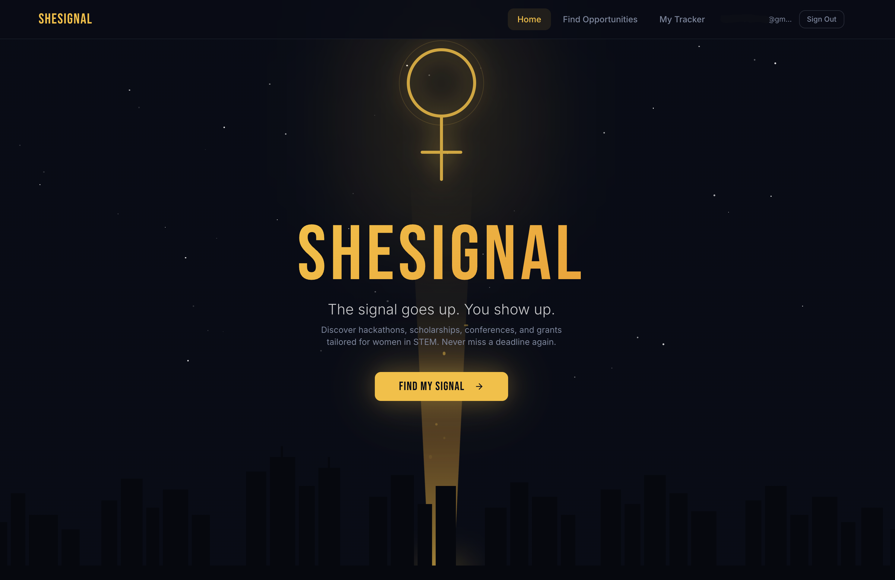
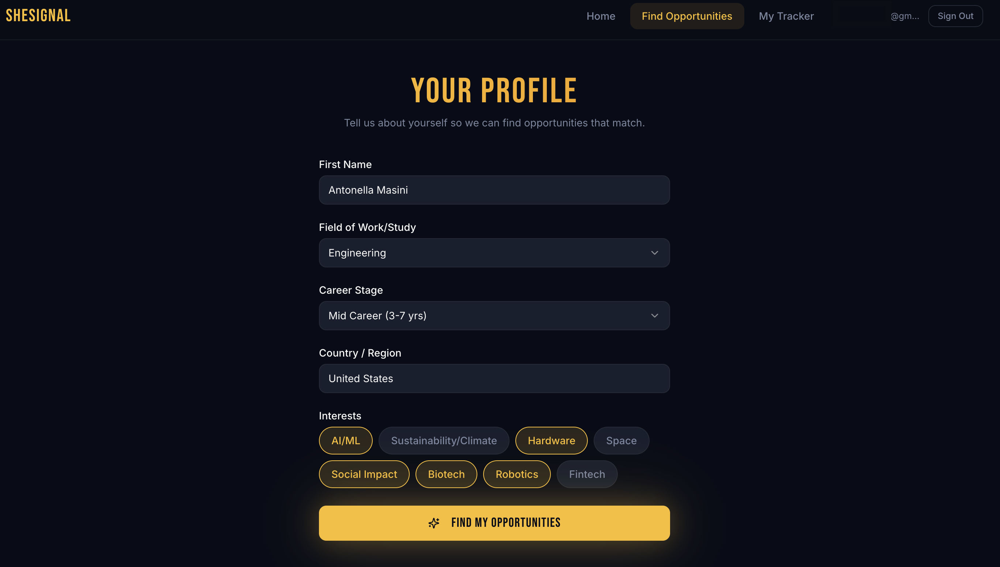
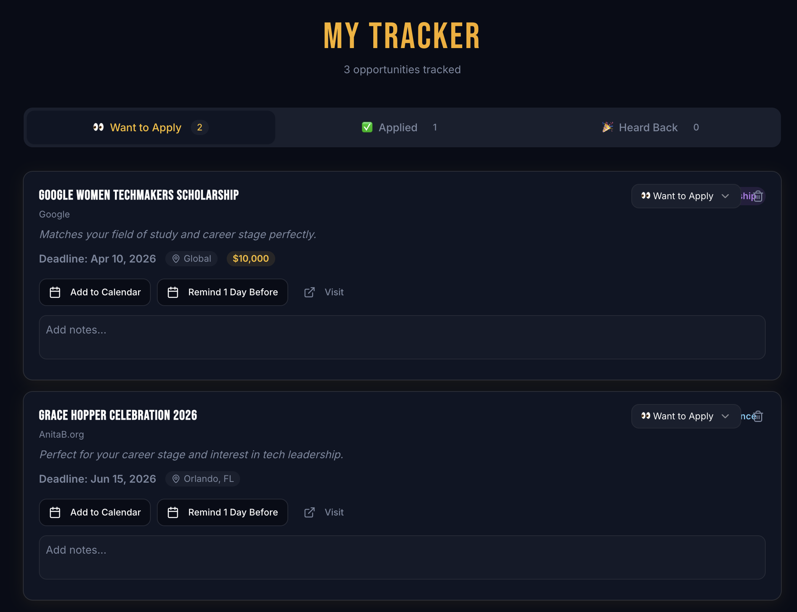

# SheSignal

> The signal goes up. You show up.

SheSignal is an AI-powered web app that helps women in STEM discover personalized opportunities — hackathons, scholarships, conferences, and grants — before the deadlines pass.

---

## Screenshots

<!-- Add screenshots to /public/screenshots/ and update paths below -->

| Landing | Signals | Tracker |
|---|---|---|
|  |  |  |

---

## Features

- **AI-curated opportunities** — Claude finds hackathons, scholarships, conferences, and grants matched to your profile
- **Personalized results** — tailored by field, career stage, country, and interests
- **Deadline tracking** — urgent deadlines highlighted, one-click Google Calendar export
- **Kanban tracker** — move opportunities through Want to Apply → Applied → Heard Back
- **Auth** — email/password and Google OAuth via Supabase

---

## Tech Stack

| Layer | Technology |
|---|---|
| Frontend | React + TypeScript + Tailwind CSS |
| UI Components | shadcn/ui (via Lovable) |
| Auth & Database | Supabase (Postgres + RLS) |
| AI Engine | Anthropic Claude (Haiku) via Supabase Edge Function |
| Build | Vite |

---

## Local Setup

### Prerequisites
- Node.js 18+
- A [Supabase](https://supabase.com) project
- An [Anthropic](https://console.anthropic.com) API key

### 1. Clone & install

```sh
git clone <your-repo-url>
cd she-signal
npm install
```

### 2. Environment variables

Create `.env.local` in the root:

```
VITE_SUPABASE_URL=https://your-project.supabase.co
VITE_SUPABASE_ANON_KEY=your-anon-key
```

### 3. Supabase setup

Run the SQL migrations in **Supabase Dashboard → SQL Editor** (see `DATABASE.md` for full SQL):
- `profiles` table + `handle_new_user` trigger
- `saved_opportunities` table
- RLS policies for both tables

Enable auth providers in **Dashboard → Authentication → Providers**:
- Email (confirm email optional for dev)
- Google (optional — requires Google OAuth client)

### 4. Deploy the Edge Function

```sh
npx supabase login
npx supabase link --project-ref <your-project-ref>
npx supabase functions deploy get-opportunities --no-verify-jwt
npx supabase secrets set ANTHROPIC_API_KEY=your-anthropic-key
```

### 5. Run locally

```sh
npm run dev
```

Open [http://localhost:8080](http://localhost:8080).

---

## Project Structure

```
/src
  /components       UI components (Lovable-generated + custom)
  /pages            Route-level pages (Landing, Login, Profile, Signal, Tracker)
  /lib              supabase.ts, calendar.ts
  /hooks            useAuth.ts, useTracker.ts
  /types            index.ts — shared TypeScript types
/supabase
  /functions
    get-opportunities/  Edge function — calls Claude API server-side
```

---

## User Flow

1. `/` — Hero landing page
2. `/login` — Sign up or sign in (email or Google)
3. `/profile` — Fill in field, career stage, country, interests
4. `/signals` — Claude returns 6–10 personalized opportunities
5. Click **Track This** → saved to Supabase
6. `/tracker` — Kanban board to manage applications

---

## Environment Variables

| Variable | Where |
|---|---|
| `VITE_SUPABASE_URL` | `.env.local` |
| `VITE_SUPABASE_ANON_KEY` | `.env.local` |
| `ANTHROPIC_API_KEY` | Supabase Edge Function secret (never in code) |

---

Built with ♀ for women in STEM.
